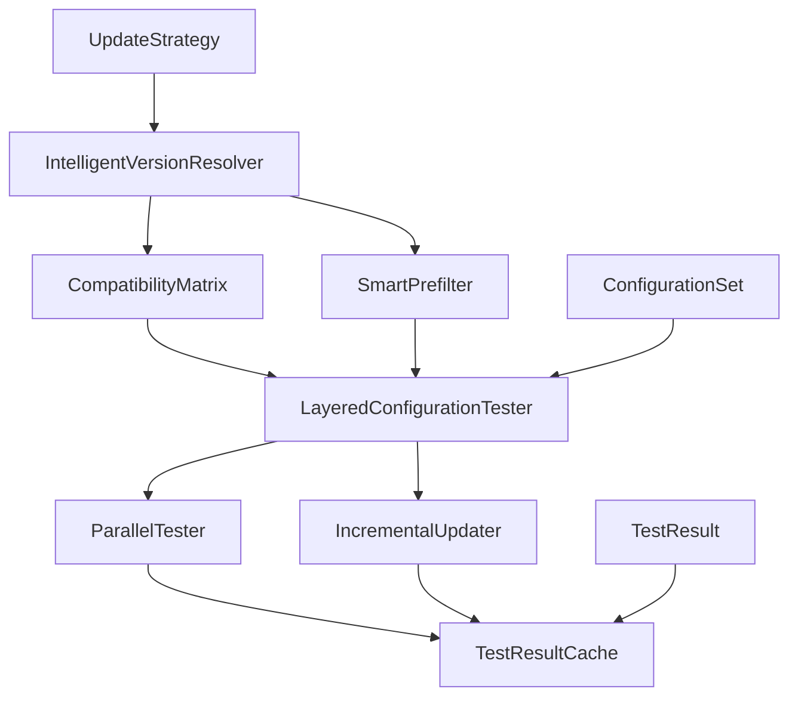
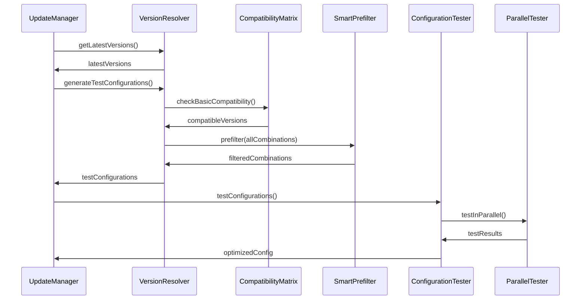
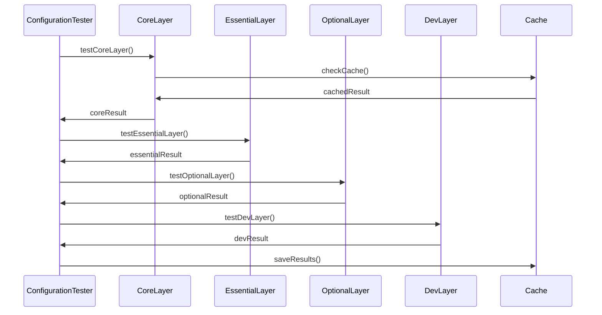

# 配置管理模块架构设计

> **文档类型**: 架构文档  
> **目标受众**: 架构师、高级开发者  
> **维护者**: Ming Status CLI 团队  
> **最后更新**: 2025-07-13

## 🎯 设计理念

### 核心目标
- **自动化**: 完全自动化的配置版本管理，消除手动维护
- **智能化**: 基于规则和数据的智能决策，避免版本冲突
- **高效性**: 通过算法优化，大幅提升测试效率
- **可靠性**: 分层验证机制，确保配置的可用性和稳定性

### 设计原则
- **单一职责**: 每个组件专注于特定的功能领域
- **开放封闭**: 对扩展开放，对修改封闭的插件化架构
- **依赖倒置**: 依赖抽象而非具体实现
- **接口隔离**: 细粒度的接口设计，避免接口污染

## 🏗️ 核心组件

### 组件图


### 组件说明

#### IntelligentVersionResolver (智能版本解析器)
- **职责**: 获取最新版本信息，生成测试配置组合
- **接口**: `getLatestVersions()`, `generateTestConfigurations()`
- **实现**: 支持多种版本源（pub.dev, npm, GitHub等）

#### CompatibilityMatrix (兼容性矩阵)
- **职责**: 快速兼容性检查，基于规则的冲突检测
- **接口**: `isCompatible()`, `generateRecommendedConfig()`
- **实现**: 预定义规则 + 动态学习机制

#### SmartPrefilter (智能预筛选器)
- **职责**: 减少测试组合数量，提升测试效率
- **接口**: `prefilter()`, `calculatePriority()`
- **实现**: 基于历史数据和启发式算法

#### LayeredConfigurationTester (分层配置测试器)
- **职责**: 执行分层测试策略，协调测试流程
- **接口**: `testByLayer()`, `testConfigurations()`
- **实现**: 核心->必需->可选->开发依赖的分层测试

## 🔄 数据流

### 配置优化流程


### 测试执行流程


## 🔗 依赖关系

### 外部依赖
- **pub_semver**: 语义化版本处理
- **http**: HTTP请求获取版本信息
- **yaml**: 配置文件解析
- **path**: 路径处理

### 内部依赖
- **UpdateManager**: 集成到更新系统
- **TemplateScaffold**: 为模板生成提供优化配置
- **Logger**: 日志记录和调试

## 📊 性能考虑

### 性能目标
- **版本解析时间**: < 2秒获取所有依赖版本
- **兼容性检查时间**: < 100ms快速验证
- **配置测试时间**: < 30秒完成50个配置测试
- **内存占用**: < 100MB峰值内存使用

### 优化策略

#### 1. 智能预筛选优化
```dart
class SmartPrefilter {
  // 基于历史成功率的优先级计算
  double calculatePriority(ConfigurationSet config) {
    final historicalSuccess = getHistoricalSuccessRate(config);
    final dependencyStability = calculateDependencyStability(config);
    final versionFreshness = calculateVersionFreshness(config);
    
    return (historicalSuccess * 0.5) + 
           (dependencyStability * 0.3) + 
           (versionFreshness * 0.2);
  }
}
```

#### 2. 并行测试优化
```dart
class ParallelTester {
  Future<List<TestResult>> testInParallel(
    List<ConfigurationSet> configs,
    {int concurrency = 4}
  ) async {
    // 使用Isolate池进行并行测试
    final pool = IsolatePool(concurrency);
    return await pool.map(configs, testSingleConfiguration);
  }
}
```

#### 3. 缓存机制优化
```dart
class TestResultCache {
  // 基于配置哈希的智能缓存
  String generateCacheKey(ConfigurationSet config) {
    final dependencies = config.dependencies.entries
        .map((e) => '${e.key}:${e.value}')
        .join(',');
    return sha256.convert(utf8.encode(dependencies)).toString();
  }
}
```

## 🔮 扩展性设计

### 插件架构
```dart
abstract class VersionResolver {
  Future<Map<String, VersionInfo>> getLatestVersions();
}

class PubDevVersionResolver implements VersionResolver {
  // pub.dev 版本解析实现
}

class NpmVersionResolver implements VersionResolver {
  // npm 版本解析实现
}
```

### 策略模式
```dart
enum TestStrategy {
  conservative,  // 保守策略：优先稳定版本
  balanced,      // 平衡策略：稳定性和新特性平衡
  aggressive,    // 激进策略：优先最新版本
}

abstract class UpdateStrategy {
  List<ConfigurationSet> generateConfigurations(
    Map<String, VersionInfo> versions,
    TestStrategy strategy,
  );
}
```

### 事件驱动架构
```dart
abstract class ConfigurationEvent {}

class VersionUpdatedEvent extends ConfigurationEvent {
  final String packageName;
  final Version newVersion;
}

class TestCompletedEvent extends ConfigurationEvent {
  final ConfigurationSet config;
  final TestResult result;
}

class ConfigurationEventBus {
  void publish(ConfigurationEvent event);
  void subscribe<T extends ConfigurationEvent>(void Function(T) handler);
}
```

## 🛡️ 错误处理策略

### 异常层次
```dart
abstract class ConfigurationException implements Exception {
  final String message;
  final dynamic cause;
}

class VersionResolutionException extends ConfigurationException {
  // 版本解析失败
}

class CompatibilityCheckException extends ConfigurationException {
  // 兼容性检查失败
}

class ConfigurationTestException extends ConfigurationException {
  // 配置测试失败
}
```

### 容错机制
- **重试机制**: 网络请求失败时的指数退避重试
- **降级策略**: 在线服务不可用时使用本地缓存
- **部分失败处理**: 部分依赖解析失败时的优雅降级

## 🔄 未来规划

### 短期计划 (v1.1)
- 机器学习辅助的配置优化
- 更多版本源支持 (GitHub, GitLab)
- 配置模板预设功能

### 长期愿景 (v2.0)
- 分布式配置测试集群
- 实时配置监控和告警
- 社区驱动的兼容性数据库

## 📋 实现检查清单

### 核心组件实现
- [ ] IntelligentVersionResolver
- [ ] CompatibilityMatrix
- [ ] SmartPrefilter
- [ ] LayeredConfigurationTester
- [ ] ParallelTester
- [ ] IncrementalUpdater
- [ ] TestResultCache

### 数据模型实现
- [ ] ConfigurationSet
- [ ] TestResult
- [ ] VersionInfo
- [ ] CompatibilityRule

### 集成实现
- [ ] UpdateManager 集成
- [ ] TemplateScaffold 集成
- [ ] CLI 命令集成

---

> **下一步**: 查看 [API文档](API.md) 了解具体的接口定义和使用方法
