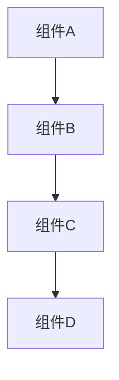
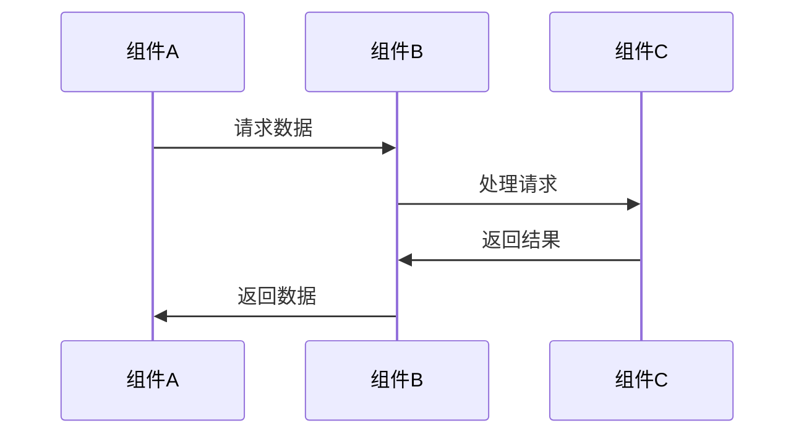

# 模块文档模板

> **文档类型**: 模板文档  
> **目标受众**: 模块开发者  
> **维护者**: Ming Status CLI 团队  
> **最后更新**: 2025-07-13  
> **版本**: 1.0.0

## 📋 概述

本文档提供了 Ming Status CLI 项目中模块文档的标准模板，确保所有模块文档的一致性和完整性。

## 🎯 模块文档结构

每个模块应包含以下7个标准文档：

### 1. README.md 模板

```markdown
# [模块名称]

> **模块类型**: [核心模块/扩展模块/工具模块]  
> **维护者**: [负责人姓名]  
> **最后更新**: [YYYY-MM-DD]  
> **版本**: [模块版本]

## 📋 概述

[模块简介，1-2段描述模块的目的和核心功能]

## ✨ 核心功能

- 🎯 **功能1**: [功能描述]
- 🔧 **功能2**: [功能描述]
- 📊 **功能3**: [功能描述]

## 🚀 快速开始

```dart
// 基本使用示例
import 'package:ming_status_cli/src/core/[模块路径]/index.dart';

void main() {
  // 示例代码
}
```

## 📁 目录结构

```
lib/src/core/[模块名]/
├── index.dart              # 导出文件
├── [主要类1].dart         # 核心实现
├── [主要类2].dart         # 核心实现
└── models/                 # 数据模型
    ├── [模型1].dart
    └── [模型2].dart
```

## 📚 相关文档

- [架构设计](ARCHITECTURE.md)
- [API文档](API.md)
- [使用指南](USAGE.md)
- [示例代码](EXAMPLES.md)
- [测试文档](TESTING.md)
- [变更日志](CHANGELOG.md)

## 🔗 依赖关系

### 依赖的模块
- [模块A](../module_a/README.md)
- [模块B](../module_b/README.md)

### 被依赖的模块
- [模块C](../module_c/README.md)
- [模块D](../module_d/README.md)
```

### 2. ARCHITECTURE.md 模板

```markdown
# [模块名称] 架构设计

> **文档类型**: 架构文档  
> **目标受众**: 架构师、高级开发者  
> **维护者**: [负责人姓名]  
> **最后更新**: [YYYY-MM-DD]

## 🎯 设计理念

### 核心目标
- [目标1]
- [目标2]
- [目标3]

### 设计原则
- **[原则1]**: [说明]
- **[原则2]**: [说明]
- **[原则3]**: [说明]

## 🏗️ 核心组件

### 组件图


### 组件说明

#### [组件A]
- **职责**: [组件职责描述]
- **接口**: [主要接口]
- **实现**: [实现要点]

#### [组件B]
- **职责**: [组件职责描述]
- **接口**: [主要接口]
- **实现**: [实现要点]

## 🔄 数据流

### 数据流图


### 流程说明
1. [步骤1描述]
2. [步骤2描述]
3. [步骤3描述]

## 🔗 依赖关系

### 外部依赖
- [依赖包1]: [用途说明]
- [依赖包2]: [用途说明]

### 内部依赖
- [模块A]: [依赖原因]
- [模块B]: [依赖原因]

## 📊 性能考虑

### 性能目标
- [性能指标1]: [目标值]
- [性能指标2]: [目标值]

### 优化策略
- [策略1]: [说明]
- [策略2]: [说明]

## 🔮 未来规划

### 短期计划
- [计划1]
- [计划2]

### 长期愿景
- [愿景1]
- [愿景2]
```

### 3. API.md 模板

```markdown
# [模块名称] API 文档

> **文档类型**: API文档  
> **目标受众**: 开发者、集成者  
> **维护者**: [负责人姓名]  
> **最后更新**: [YYYY-MM-DD]

## 📋 概述

[API概述，说明模块提供的主要接口和功能]

## 🔧 核心类

### [主要类名]

#### 构造函数

```dart
/// [类描述]
class [类名] {
  /// 创建[类名]实例
  /// 
  /// [参数1]: [参数描述]
  /// [参数2]: [参数描述]
  [类名]({
    required [类型] [参数1],
    [类型]? [参数2],
  });
}
```

#### 主要方法

##### [方法名]

```dart
/// [方法描述]
/// 
/// 参数:
/// - [参数1]: [参数描述]
/// - [参数2]: [参数描述]
/// 
/// 返回值:
/// - [返回值描述]
/// 
/// 异常:
/// - [异常类型]: [异常条件]
/// 
/// 示例:
/// ```dart
/// final result = await instance.[方法名]([参数]);
/// ```
Future<[返回类型]> [方法名]([参数列表]);
```

## 📊 数据模型

### [模型名]

```dart
/// [模型描述]
class [模型名] {
  /// [字段描述]
  final [类型] [字段名];
  
  /// 构造函数
  const [模型名]({
    required this.[字段名],
  });
  
  /// 从JSON创建实例
  factory [模型名].fromJson(Map<String, dynamic> json);
  
  /// 转换为JSON
  Map<String, dynamic> toJson();
}
```

## 🔧 工具函数

### [函数名]

```dart
/// [函数描述]
/// 
/// 参数:
/// - [参数1]: [参数描述]
/// 
/// 返回值:
/// - [返回值描述]
[返回类型] [函数名]([参数列表]);
```

## ⚠️ 异常处理

### [异常类名]

```dart
/// [异常描述]
class [异常类名] extends Exception {
  /// 错误消息
  final String message;
  
  /// 构造函数
  const [异常类名](this.message);
}
```

### 异常处理示例

```dart
try {
  final result = await someMethod();
} on [异常类名] catch (e) {
  // 处理特定异常
  print('错误: ${e.message}');
} catch (e) {
  // 处理其他异常
  print('未知错误: $e');
}
```

## 📝 使用注意事项

- **注意事项1**: [说明]
- **注意事项2**: [说明]
- **注意事项3**: [说明]
```

### 4. USAGE.md 模板

```markdown
# [模块名称] 使用指南

> **文档类型**: 使用指南  
> **目标受众**: 开发者、用户  
> **维护者**: [负责人姓名]  
> **最后更新**: [YYYY-MM-DD]

## 📋 概述

[使用指南概述，说明本文档的内容和适用场景]

## 🚀 基本用法

### 1. 导入模块

```dart
import 'package:ming_status_cli/src/core/[模块路径]/index.dart';
```

### 2. 基本初始化

```dart
// 创建实例
final [实例名] = [类名]([参数]);

// 初始化
await [实例名].initialize();
```

### 3. 基本操作

```dart
// 基本操作示例
final result = await [实例名].[方法名]([参数]);
print('结果: $result');
```

## 🔧 高级用法

### 1. 配置选项

```dart
// 高级配置示例
final [实例名] = [类名](
  [参数1]: [值1],
  [参数2]: [值2],
  // 更多配置...
);
```

### 2. 自定义处理

```dart
// 自定义处理示例
[实例名].onEvent = (event) {
  // 自定义事件处理
};
```

## ⚙️ 配置选项

### 基本配置

| 选项名 | 类型 | 默认值 | 描述 |
|--------|------|--------|------|
| [选项1] | [类型] | [默认值] | [描述] |
| [选项2] | [类型] | [默认值] | [描述] |

### 高级配置

| 选项名 | 类型 | 默认值 | 描述 |
|--------|------|--------|------|
| [选项1] | [类型] | [默认值] | [描述] |
| [选项2] | [类型] | [默认值] | [描述] |

## 🎯 最佳实践

### 1. 性能优化

- **建议1**: [说明]
- **建议2**: [说明]

### 2. 错误处理

- **建议1**: [说明]
- **建议2**: [说明]

### 3. 资源管理

- **建议1**: [说明]
- **建议2**: [说明]

## ⚠️ 常见问题

### Q: [问题1]
A: [解答1]

### Q: [问题2]
A: [解答2]

## 🔗 相关资源

- [相关文档1](链接)
- [相关文档2](链接)
```

## 📋 使用说明

### 1. 创建新模块文档

1. 复制模板文件到模块目录
2. 替换所有 `[占位符]` 为实际内容
3. 根据模块特点调整结构
4. 填写具体内容

### 2. 模板定制

- 根据模块类型调整模板结构
- 添加模块特有的章节
- 删除不适用的部分
- 保持核心结构不变

### 3. 质量检查

使用 [文档检查清单](documentation-standards.md#检查清单) 确保文档质量。

---

> **维护者**: Ming Status CLI 团队  
> **最后更新**: 2025-07-13  
> **版本**: 1.0.0
