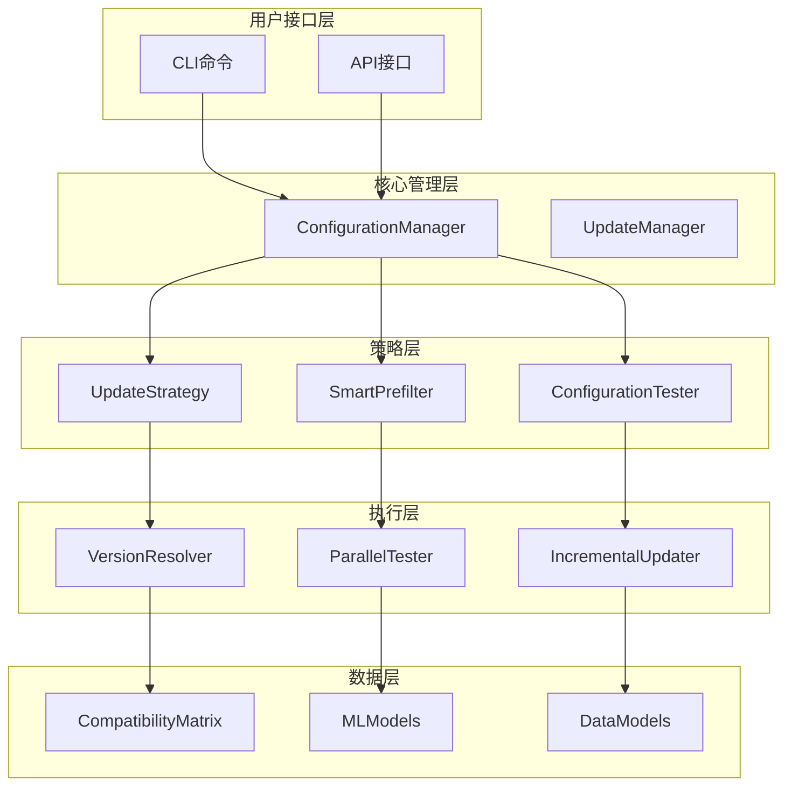
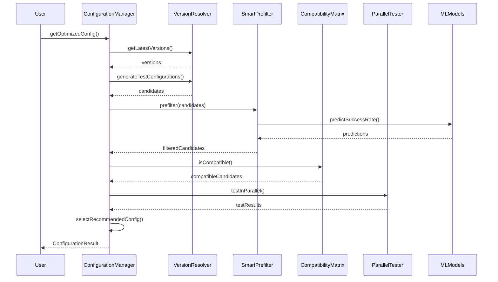
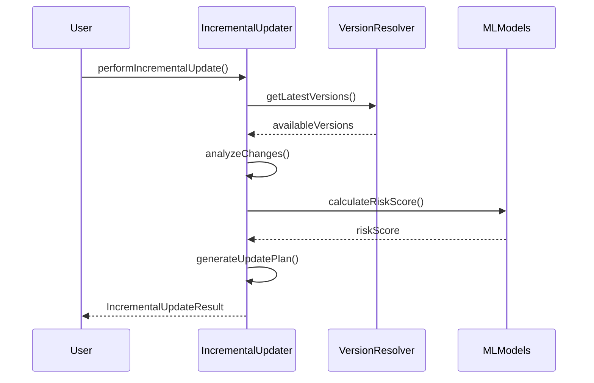

# 配置管理系统架构文档

## 🏗️ 系统架构概览

配置管理系统采用分层架构设计，结合机器学习和并行处理技术，提供高效、智能的依赖配置管理能力。



## 🔧 核心组件设计

### 1. ConfigurationManager (配置管理器)

**职责**: 系统的主要入口点，协调所有子组件完成配置管理任务。

**设计模式**: 
- **外观模式**: 为复杂的子系统提供统一接口
- **策略模式**: 支持多种配置优化策略

**核心方法**:
```dart
class ConfigurationManager {
  // 获取优化配置 - 主要入口点
  Future<ConfigurationResult> getOptimizedConfig({
    ConfigurationSet? currentConfig,
    List<String>? packageNames,
    ConfigurationStrategy strategy = ConfigurationStrategy.balanced,
  });
  
  // 检查配置兼容性
  Future<bool> checkConfigurationCompatibility(ConfigurationSet config);
  
  // 预测配置成功率
  Future<double> predictConfigurationSuccess(ConfigurationSet config);
}
```

### 2. VersionResolver (版本解析器)

**职责**: 智能解析和推荐版本组合，生成候选配置。

**设计特点**:
- **缓存机制**: 避免重复的网络请求
- **版本约束解析**: 支持复杂的版本约束语法
- **并发获取**: 并行获取多个包的版本信息

**算法流程**:
```
1. 解析版本约束 → 2. 获取可用版本 → 3. 生成版本组合 → 4. 应用策略筛选
```

### 3. CompatibilityMatrix (兼容性矩阵)

**职责**: 维护和检查依赖包之间的兼容性关系。

**数据结构**:
```dart
class CompatibilityMatrix {
  // 兼容性规则存储
  final Map<String, Map<String, VersionConstraint>> _compatibilityRules;
  
  // 冲突模式检测
  final Map<String, List<String>> _conflictPatterns;
  
  // 平台特定兼容性
  final Map<String, Map<String, bool>> _platformCompatibility;
}
```

### 4. SmartPrefilter (智能预筛选器)

**职责**: 使用启发式算法和历史数据预筛选配置候选。

**筛选策略**:
- **历史成功模式**: 基于历史测试结果
- **启发式规则**: 基于经验规则
- **ML预测**: 基于机器学习模型
- **混合策略**: 结合多种方法

### 5. ParallelTester (并行测试器)

**职责**: 高效并行执行配置测试和验证。

**并发模型**:
```dart
class ParallelTester {
  // 工作线程池
  final List<TestWorker> _workers;
  
  // 任务队列
  final Queue<TestTask> _taskQueue;
  
  // 结果收集
  final Map<String, Completer<TestResult>> _pendingTasks;
}
```

**性能优化**:
- **工作线程池**: 复用线程减少创建开销
- **任务调度**: 智能任务分配和负载均衡
- **结果缓存**: 避免重复测试相同配置

### 6. MLModels (机器学习模型)

**职责**: 提供配置成功率预测和风险评估。

**模型架构**:
```dart
class ConfigurationSuccessPredictor {
  // 线性回归模型集合
  final List<LinearRegressionModel> _linearModels;
  
  // 决策树模型集合
  final List<DecisionTreeModel> _treeModels;
  
  // 模型权重
  final List<double> _modelWeights;
}
```

**特征工程**:
- **依赖特征**: 包数量、版本新鲜度、复杂度
- **历史特征**: 成功率、测试次数、错误模式
- **环境特征**: 平台、SDK版本、项目类型

## 🔄 数据流设计

### 配置优化流程



### 增量更新流程



## 🎯 设计原则

### 1. 单一职责原则 (SRP)
每个组件都有明确的单一职责：
- `VersionResolver`: 只负责版本解析
- `CompatibilityMatrix`: 只负责兼容性检查
- `ParallelTester`: 只负责并行测试

### 2. 开闭原则 (OCP)
系统对扩展开放，对修改关闭：
- 策略模式支持新的优化策略
- 插件化的ML模型支持
- 可扩展的兼容性规则

### 3. 依赖倒置原则 (DIP)
高层模块不依赖低层模块：
- 抽象接口定义组件契约
- 依赖注入支持组件替换
- 模拟对象支持单元测试

### 4. 接口隔离原则 (ISP)
客户端不应依赖不需要的接口：
- 细粒度的接口设计
- 按需暴露功能
- 最小化API表面

## 🚀 性能优化策略

### 1. 缓存策略
```dart
class CacheStrategy {
  // 版本信息缓存 (1小时过期)
  final Map<String, CachedVersionInfo> _versionCache;
  
  // 兼容性检查缓存 (永久缓存)
  final Map<String, bool> _compatibilityCache;
  
  // 测试结果缓存 (24小时过期)
  final Map<String, TestResult> _testResultCache;
}
```

### 2. 并发优化
- **并行版本获取**: 同时获取多个包的版本信息
- **并行配置测试**: 同时测试多个配置组合
- **流水线处理**: 重叠执行不同阶段的任务

### 3. 内存管理
- **惰性加载**: 按需加载大型数据结构
- **对象池**: 复用频繁创建的对象
- **垃圾回收优化**: 及时释放不需要的引用

### 4. 算法优化
- **剪枝策略**: 提前终止不可能成功的分支
- **启发式搜索**: 优先测试高概率成功的配置
- **增量计算**: 基于之前结果进行增量计算

## 🔒 错误处理和恢复

### 1. 错误分类
```dart
enum ConfigurationErrorType {
  networkError,        // 网络连接错误
  versionNotFound,     // 版本不存在
  compatibilityError, // 兼容性冲突
  testTimeout,         // 测试超时
  configurationError, // 配置错误
}
```

### 2. 恢复策略
- **重试机制**: 指数退避重试网络请求
- **降级策略**: 网络失败时使用缓存数据
- **部分成功**: 返回部分成功的结果
- **错误聚合**: 收集并报告所有错误

### 3. 监控和日志
```dart
class ConfigurationLogger {
  // 性能监控
  void logPerformanceMetrics(String operation, Duration duration);
  
  // 错误追踪
  void logError(String operation, Exception error, StackTrace stackTrace);
  
  // 配置变更审计
  void logConfigurationChange(ConfigurationSet from, ConfigurationSet to);
}
```

## 🔮 扩展性设计

### 1. 插件化架构
```dart
abstract class ConfigurationPlugin {
  String get name;
  Future<void> initialize();
  Future<ConfigurationResult> process(ConfigurationRequest request);
}
```

### 2. 事件驱动
```dart
class ConfigurationEventBus {
  // 配置变更事件
  Stream<ConfigurationChangedEvent> get onConfigurationChanged;
  
  // 测试完成事件
  Stream<TestCompletedEvent> get onTestCompleted;
  
  // 错误事件
  Stream<ErrorEvent> get onError;
}
```

### 3. 配置化
```dart
class ConfigurationSettings {
  // 可配置的算法参数
  final Map<String, dynamic> algorithmParameters;
  
  // 可配置的性能参数
  final Map<String, dynamic> performanceParameters;
  
  // 可配置的行为参数
  final Map<String, dynamic> behaviorParameters;
}
```

---

**架构设计目标**: 构建一个高性能、可扩展、易维护的企业级配置管理系统 🎯
